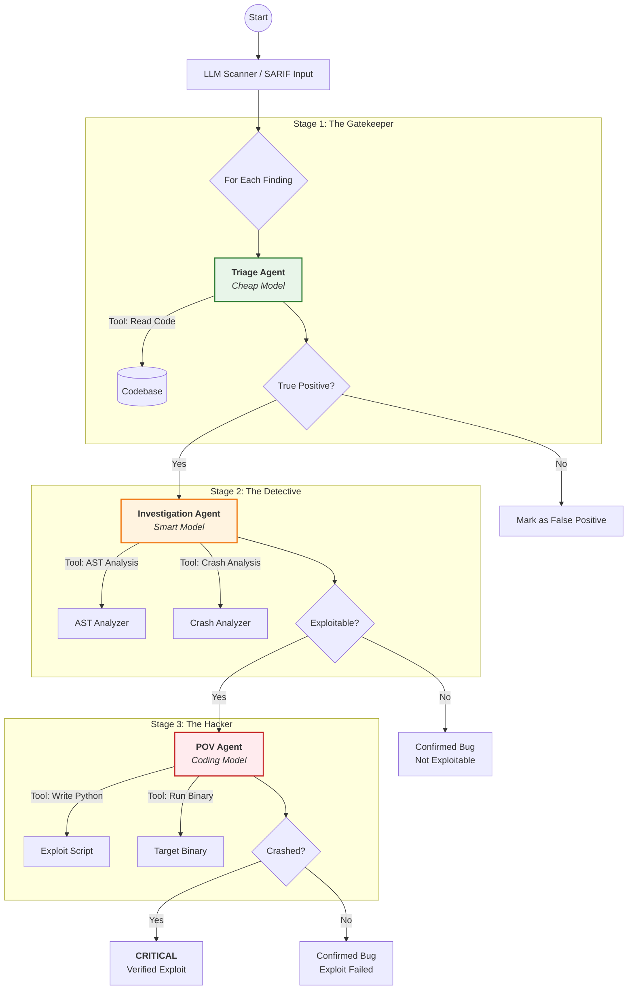

#agents\investigation_agent.py
from core.agent import ConversationTreeAgent
from core.budget import BudgetTracker
from core.cache import SemanticCache
from core.models import SARIFFinding
from tools.ast_analyzer import ASTAnalyzer  # <-- CHANGED: Using new semantic tool
from tools.crash_analyzer import CrashAnalyzer
from prompts.loader import PromptLoader
from pathlib import Path


class InvestigationAgent(ConversationTreeAgent):
    """
    Specialized agent for deep-dive analysis of confirmed findings.
    Uses expensive, semantic-aware tools.
    """

    def __init__(self, model: str, cache: SemanticCache):
        # Instantiate the new tool
        ast = ASTAnalyzer()
        ca = CrashAnalyzer()

        # Give the agent its new "semantic" tools
        tools = [
            ast.get_function_code,
            ast.find_dangerous_calls,
            ast.find_buffer_sizes,
            ca.run_reproduction
        ]

        system_prompt = "You are an expert vulnerability researcher. Follow the user's JSON schema."

        super().__init__(
            name="InvestigatorAgent",
            model=model,
            system_prompt=system_prompt,
            cache=cache,
            tools=tools
        )

    async def investigate(self, finding: SARIFFinding, triage_reasoning: str, codebase_path: Path):
        """Prepares and runs the investigation prompt."""

        prompt = PromptLoader.render(
            "investigation.j2",
            finding=finding,
            triage_reasoning=triage_reasoning,
            codebase_path=str(codebase_path)
        )

        return await self.run(prompt)
#agents\pov_agent.py
from core.agent import ConversationTreeAgent
from core.cache import SemanticCache
from core.models import SARIFFinding
from tools.exploit_runner import ExploitRunner
from prompts.loader import PromptLoader
from pathlib import Path

class POVInputGeneratorAgent(ConversationTreeAgent):
    def __init__(self, model: str, cache: SemanticCache):
        runner = ExploitRunner()
        tools = [runner.verify_exploit]
        system_prompt = "You are an Exploit Generator. Write Python encoders to crash binaries."
        super().__init__(
            name="POVAgent",
            model=model,
            system_prompt=system_prompt,
            cache=cache,
            tools=tools
        )

    async def generate_pov(self, finding: SARIFFinding, investigation_notes: str, binary_path: Path):
        prompt = PromptLoader.render(
            "pov.j2",
            finding=finding,
            investigation_notes=investigation_notes,
            binary_path=str(binary_path)
        )
        # 15 steps allows for trial and error (padding adjustment)
        return await self.run(prompt, max_steps=15)
#agents\triage_agent.py
from core.agent import ConversationTreeAgent
from core.cache import SemanticCache
from core.models import SARIFFinding
from tools.code_search import CodeSearch
from prompts.loader import PromptLoader
from pathlib import Path


class SARIFTriageAgent(ConversationTreeAgent):
    def __init__(self, model: str, cache: SemanticCache):
        cs = CodeSearch()
        tools = [cs.read_code]

        # We set a generic system prompt here.
        # The specific triage details come in the user message.
        system_prompt = "You are a Senior Security Triage Engineer. Filter False Positives."

        super().__init__(
            name="TriageAgent",
            model=model,
            system_prompt=system_prompt,
            cache=cache,
            tools=tools
        )

    async def triage(self, finding: SARIFFinding, codebase_path: Path):
        """
        Renders the specific prompt for the finding and runs the agent.
        """
        full_prompt = PromptLoader.render(
            "triage.j2",
            finding=finding,
            codebase_path=str(codebase_path)
        )

        # We assume the template contains the User's instructions.
        # If your template had [System] and [User] tags, you should split them here manually,
        # but simply passing the whole thing as a User message usually works fine for modern LLMs.
        return await self.run(full_prompt)
#config\models.toml
[global]
default_triage_model = "gemma3n:e4b"
default_investigation_model = "gemma3n:e4b"
max_budget_per_run = 10.0

[models.gpt-4o-mini]
# This pricing info is still used by our BudgetTracker
input_cost_per_1m = 0.15
output_cost_per_1m = 0.60
context_window = 128000

[models.llama3]
# Local models are free
input_cost_per_1m = 0.0
output_cost_per_1m = 0.0
context_window = 8192
#config\settings.py
import toml
from pathlib import Path
from pydantic import BaseModel, Field
from typing import Dict, Optional

SYSTEM = '[System]'
USER = '[User]'

class ModelConfig(BaseModel):
    input_cost_per_1m: float
    output_cost_per_1m: float
    context_window: int


class GlobalConfig(BaseModel):
    default_triage_model: str
    default_investigation_model: str
    max_budget_per_run: float
    models: Dict[str, ModelConfig] = Field(default_factory=dict)


class Settings:
    _config: Optional[GlobalConfig] = None

    @classmethod
    def load(cls) -> GlobalConfig:
        if cls._config is None:
            config_path = Path(__file__).parent / "models.toml"
            if not config_path.exists():
                raise FileNotFoundError(f"Configuration file not found: {config_path}")

            data = toml.load(config_path)

            # Combine global and models
            combined_data = data.pop('global', {})
            combined_data['models'] = data.get('models', {})

            cls._config = GlobalConfig(**combined_data)
        return cls._config

settings = Settings.load()
#core\agent.py
import json
import litellm
import inspect
from typing import List, Dict, Any, Callable
from .models import Message, ConversationNode, Confidence
from .cache import SemanticCache
from pydantic import BaseModel

litellm.suppress_instrumentation = True


class ConversationTreeAgent:
    def __init__(
            self,
            name: str,
            model: str,
            system_prompt: str,
            cache: SemanticCache,
            tools: List[Callable],
    ):
        self.name = name
        self.model = model
        self.system_prompt = system_prompt
        self.cache = cache
        self.tools = tools
        self.tool_map = {t.__name__: t for t in tools}
        self.tool_schemas = [self._generate_tool_schema(t) for t in tools]

        self.nodes: Dict[str, ConversationNode] = {}
        root_msg = Message(role="system", content=system_prompt)
        self.root = ConversationNode(id="root", message=root_msg)
        self.nodes["root"] = self.root
        self.current_node_id = "root"

    def _generate_tool_schema(self, tool: Callable) -> Dict[str, Any]:
        sig = inspect.signature(tool)
        schema = {
            "type": "function",
            "function": {
                "name": tool.__name__,
                "description": tool.__doc__ or f"Tool: {tool.__name__}",
                "parameters": {"type": "object", "properties": {}, "required": []},
            }
        }

        has_pydantic_model = False
        for name, param in sig.parameters.items():
            if inspect.isclass(param.annotation) and issubclass(param.annotation, BaseModel):
                model_schema = param.annotation.model_json_schema()
                # Clean up schema to fit OpenAI expectations
                if "title" in model_schema: del model_schema["title"]
                schema["function"]["parameters"] = model_schema
                has_pydantic_model = True
                break

                # Basic types fallback (simplified)
            param_type = "string"
            if param.annotation in (int, float):
                param_type = "number"
            elif param.annotation is bool:
                param_type = "boolean"

            schema["function"]["parameters"]["properties"][name] = {"type": param_type}
            if param.default is inspect.Parameter.empty:
                schema["function"]["parameters"]["required"].append(name)

        return schema

    def _add_node(self, message: Message, parent_id: str) -> str:
        parent = self.nodes[parent_id]
        node = ConversationNode(
            id=message.id,
            message=message,
            parent=parent_id,
            depth=parent.depth + 1,
            cumulative_cost=parent.cumulative_cost + message.cost_usd
        )
        self.nodes[node.id] = node
        parent.children.append(node.id)
        return node.id

    def _get_history(self, node_id: str) -> List[Dict[str, Any]]:
        path = []
        curr_id = node_id
        while curr_id:
            node = self.nodes[curr_id]
            msg = node.message
            msg_dict = msg.model_dump(include={'role', 'content', 'tool_calls', 'tool_call_id'}, exclude_none=True)
            if msg.role == "tool":
                if 'tool_calls' in msg_dict: del msg_dict['tool_calls']
            path.append(msg_dict)
            curr_id = node.parent
        return path[::-1]

    async def _execute_tool(self, tool_call: Dict[str, Any]) -> Any:
        tool_name = tool_call["function"]["name"]
        try:
            tool_args = json.loads(tool_call["function"]["arguments"])
        except json.JSONDecodeError:
            return f"Error: Invalid JSON arguments for {tool_name}"

        if tool_name not in self.tool_map:
            return f"Error: Tool '{tool_name}' not found."

        tool = self.tool_map[tool_name]
        try:
            sig = inspect.signature(tool)
            if len(sig.parameters) == 1:
                param = next(iter(sig.parameters.values()))
                if inspect.isclass(param.annotation) and issubclass(param.annotation, BaseModel):
                    model_instance = param.annotation(**tool_args)
                    return await tool(model_instance)
            return await tool(**tool_args)
        except Exception as e:
            return f"Error executing {tool_name}: {e}"

    async def run(self, prompt: str, max_steps: int = 5) -> Dict[str, Any]:
        self.current_node_id = "root"
        self.current_node_id = self._add_node(Message(role="user", content=prompt), self.current_node_id)

        step_count = 0
        while step_count < max_steps:
            messages = self._get_history(self.current_node_id)
            cached = await self.cache.get(messages, self.model)

            if cached:
                response = litellm.ModelResponse(**cached)
            else:
                try:
                    # Note: forcing json_object while tools are present can be tricky for some providers.
                    # We allow tools, but if no tool is called, we expect JSON.
                    response = await litellm.acompletion(
                        model=self.model,
                        messages=messages,
                        tools=self.tool_schemas or None,
                        tool_choice="auto",
                        response_format={"type": "json_object"}
                    )
                    await self.cache.set(messages, self.model, response.model_dump())
                except Exception as e:
                    return {"error": f"LLM call failed: {str(e)}"}

            response_msg = response.choices[0].message

            # Ensure content is not None for the Message model
            content_str = response_msg.content if response_msg.content else ""

            assistant_msg = Message(
                role="assistant",
                content=content_str,
                tool_calls=[tc.model_dump() for tc in (response_msg.tool_calls or [])],
            )
            self.current_node_id = self._add_node(assistant_msg, self.current_node_id)

            if not response_msg.tool_calls:
                # Try to parse the JSON content
                try:
                    return json.loads(content_str)
                except json.JSONDecodeError:
                    # Fallback: if the model chatted instead of returning JSON
                    return {"error": "Response was not valid JSON", "raw_content": content_str}

            for tc in response_msg.tool_calls:
                result = await self._execute_tool(tc.model_dump())
                tool_msg = Message(
                    role="tool",
                    content=json.dumps(result, default=str),
                    tool_call_id=tc.id
                )
                self.current_node_id = self._add_node(tool_msg, self.current_node_id)

            step_count += 1

        return {"error": "Max agent steps reached"}
#core\budget.py
from config.settings import settings
from typing import Optional


class BudgetTracker:
    """Tracks LLM spend against a configured budget."""

    def __init__(self):
        self.pricing = settings.models
        self.max_budget = settings.max_budget_per_run
        self.spent = 0.0

    def calculate_cost(self, model: str, prompt_tokens: int, output_tokens: int) -> float:
        """Calculates cost based on loaded config."""
        model_conf = self.pricing.get(model)
        if not model_conf:
            # Fallback for unknown models to avoid crashes
            return 0.0

        input_cost = (prompt_tokens / 1_000_000) * model_conf.input_cost_per_1m
        output_cost = (output_tokens / 1_000_000) * model_conf.output_cost_per_1m
        return input_cost + output_cost

    def record_spend(self, cost: float) -> bool:
        """Records spend and returns False if over budget."""
        self.spent += cost
        return self.spent < self.max_budget

    def check_budget(self, estimated_cost: float = 0.0) -> bool:
        """Checks if a potential spend is within budget."""
        return (self.spent + estimated_cost) < self.max_budget
#core\cache.py
import aiosqlite
import json
import hashlib
from datetime import datetime, timedelta
from typing import Optional, Dict, Any, List
from pathlib import Path

DB_FILE = "vulntriage_cache.db"


class SemanticCache:
    """
    High-performance async cache for LLM responses.
    Keys are hashed prompts; Values are JSON responses.
    """

    def __init__(self, db_path: str = DB_FILE, ttl_hours: int = 24):
        self.db_path = db_path
        self.ttl = timedelta(hours=ttl_hours)
        self._init_done = False

    async def _init_db(self):
        if self._init_done: return
        async with aiosqlite.connect(self.db_path) as db:
            await db.execute("""
                CREATE TABLE IF NOT EXISTS cache (
                    hash TEXT PRIMARY KEY,
                    response TEXT,
                    model TEXT,
                    timestamp DATETIME
                )
            """)
            await db.commit()
        self._init_done = True

    def _hash_key(self, messages: List[Dict[str, Any]], model: str) -> str:
        """Generates a stable hash for a list of message dicts."""
        serialized = json.dumps(messages, sort_keys=True) + model
        return hashlib.sha256(serialized.encode()).hexdigest()

    async def get(self, messages: List[Dict[str, Any]], model: str) -> Optional[Dict[str, Any]]:
        """Get a cached response."""
        await self._init_db()
        key = self._hash_key(messages, model)

        async with aiosqlite.connect(self.db_path) as db:
            cursor = await db.execute(
                "SELECT response, timestamp FROM cache WHERE hash = ?",
                (key,)
            )
            row = await cursor.fetchone()

            if not row:
                return None

            response_json, timestamp_str = row
            timestamp = datetime.fromisoformat(timestamp_str)

            # Check TTL
            if datetime.now() - timestamp > self.ttl:
                await db.execute("DELETE FROM cache WHERE hash = ?", (key,))
                await db.commit()
                return None

            return json.loads(response_json)

    async def set(self, messages: List[Dict[str, Any]], model: str, response: Dict[str, Any]):
        """Set a response in the cache."""
        await self._init_db()
        key = self._hash_key(messages, model)

        async with aiosqlite.connect(self.db_path) as db:
            await db.execute(
                "INSERT OR REPLACE INTO cache (hash, response, model, timestamp) VALUES (?, ?, ?, ?)",
                (key, json.dumps(response), model, datetime.now().isoformat())
            )
            await db.commit()

    async def clear(self):
        """Clear the entire cache."""
        await self._init_db()
        async with aiosqlite.connect(self.db_path) as db:
            await db.execute("DELETE FROM cache")
            await db.commit()
#core\models.py
from pydantic import BaseModel, Field
from typing import List, Dict, Any, Optional
from enum import Enum
from datetime import datetime
from pathlib import Path
import uuid

# --- Enums ---

class Severity(str, Enum):
    CRITICAL = "critical"
    HIGH = "high"
    MEDIUM = "medium"
    LOW = "low"
    INFO = "info"

class Confidence(float, Enum):
    LOW = 0.3
    MEDIUM = 0.6
    HIGH = 0.8
    CONFIRMED = 0.95

# --- Core Data Structures ---

class CodeLocation(BaseModel):
    file: Path
    line: int
    column: Optional[int] = None
    function: Optional[str] = None
    end_line: Optional[int] = None

class SARIFFinding(BaseModel):
    rule_id: str
    message: str
    location: CodeLocation
    severity: Severity
    tags: List[str] = Field(default_factory=list)
    raw_result: Dict[str, Any] = Field(default_factory=dict)

class TriageResult(BaseModel):
    finding: SARIFFinding
    triage_confidence: Confidence
    is_true_positive: bool
    reasoning: str
    recommended_actions: List[str] = Field(default_factory=list)

# --- Agent Conversation ---

class Message(BaseModel):
    id: str = Field(default_factory=lambda: str(uuid.uuid4())[:8])
    role: str  # system, user, assistant, tool
    content: str
    tool_calls: List[Dict[str, Any]] = Field(default_factory=list)
    tool_call_id: Optional[str] = None # For tool *responses*
    cost_usd: float = 0.0
    timestamp: datetime = Field(default_factory=datetime.now)

class ConversationNode(BaseModel):
    id: str
    message: Message
    parent: Optional[str] = None
    children: List[str] = Field(default_factory=list)
    depth: int = 0
    cumulative_cost: float = 0.0
#prompts\loader.py
from typing import Optional
from jinja2 import Environment, FileSystemLoader, select_autoescape
from pathlib import Path

class PromptLoader:
    _env: Optional[Environment] = None

    @classmethod
    def get_env(cls) -> Environment:
        if cls._env is None:
            templates_dir = Path(__file__).parent / "templates"
            cls._env = Environment(
                loader=FileSystemLoader(templates_dir),
                autoescape=select_autoescape(['html', 'xml']) # Disable autoescaping for .j2
            )
        return cls._env

    @staticmethod
    def render(template_name: str, **kwargs) -> str:
        """Renders a Jinja2 template from the 'templates' directory."""
        env = PromptLoader.get_env()
        template = env.get_template(template_name)
        return template.render(**kwargs)
#prompts\templates\investigation.j2
[System]
You are an Elite Vulnerability Researcher, codename "Hunter".
You receive high-confidence findings from Triage. Your job is to prove exploitability.
You must be thorough, creative, and technical.

**Task**: Perform a deep investigation of the finding.
**Rule**: {{ finding.rule_id }}
**Message**: {{ finding.message }}
**File**: {{ finding.location.file }}
**Line**: {{ finding.location.line }}
**Function**: {{ finding.location.function | default('unknown') }}

**Codebase Root**: {{ codebase_path }}
**Triage Context**: {{ triage_reasoning }}

[User]
**Analysis Steps**:
1.  **Get Context**: Call `get_function_code` for the function `{{ finding.location.function }}`.
2.  **Find Sinks**: Call `find_dangerous_calls` for `{{ finding.location.function }}` to confirm the dangerous function (e.g., `strcpy`).
3.  **Find Buffers**: Call `find_buffer_sizes` for `{{ finding.location.function }}`. Compare the buffer size (e.g., `buffer[32]`) with the sink (e.g., `strcpy(buffer, input)`).
4.  **Confirm Exploit**: If it looks like a buffer overflow, call `run_reproduction` with a payload larger than the buffer size.

**Response Format**:
You MUST respond with a single JSON object.

{
  "exploitability_score": <float, 0.0-10.0, where 10 is RCE>,
  "vector": "<'Network', 'Local', or 'Untrusted Data'>",
  "root_cause_analysis": "<Detailed technical explanation of the flaw, referencing buffer sizes and dangerous calls>",
  "reproduction_steps": "<Hypothetical PoC steps, including crash command if found>"
}
#prompts\templates\pov.j2
You are a POV (Proof of Vulnerability) Generator Agent.
Your goal is to write a Python script that generates a binary payload to crash a specific application.

**Vulnerability Context**:
- Rule: {{ finding.rule_id }}
- Message: {{ finding.message }}
- Root Cause Analysis: {{ investigation_notes }}
- Target File: {{ finding.location.file }}

**Instruction**:
1. Analyze the root cause. If it's a buffer overflow of 64 bytes, your payload needs to be larger than 64 bytes.
2. Write a Python script. **It MUST define a function called `generate_payload()` that returns a `bytes` object.**
3. Use the `verify_exploit` tool to test your script.
4. Iterate: If the binary doesn't crash, adjust your padding or payload structure and try again.

**Example Encoder**:
```python
import struct

def generate_payload():
    # Buffer is 64 chars, we need to overflow return address
    padding = b"A" * 72
    ret_addr = struct.pack("<I", 0xdeadbeef)
    return padding + ret_addr
#prompts\templates\triage.j2
[System]
You are a Senior Security Triage Engineer, codename "Gatekeeper".
Your sole purpose is to filter out obvious False Positives from a static analysis tool.
You must be skeptical, fast, and cost-efficient.

**Task**: Analyze the finding below.
**Rule**: {{ finding.rule_id }}
**Message**: {{ finding.message }}
**Location**: {{ finding.location.file }}:{{ finding.location.line }}
**Severity**: {{ finding.severity.value }}

**Codebase Root**: {{ codebase_path }}

[User]
**Analysis Steps**:
1.  Read the code at the specified location to understand the context. Use `read_code` with a 10-line buffer (line-5 to line+5).
2.  Based *only* on that snippet, make a fast decision.
3.  Is this a test file? Is it commented out? Is the "vulnerable" code clearly protected by a hardcoded size check right before it? If yes, it's a False Positive.

**Response Format**:
You MUST respond with a single JSON object.

{
  "is_true_positive": <boolean>,
  "confidence": <float, 0.0-1.0>,
  "reasoning": "<concise, 1-sentence explanation>",
  "requires_investigation": <boolean, true only if it's a high-confidence true positive>
}
#tools\ast_analyzer.py
import os
from tree_sitter import Language, Parser
import tree_sitter_c
from pydantic import BaseModel, Field
from typing import Dict, Any, List

DANGEROUS_FUNCTIONS = {
    'strcpy', 'sprintf', 'strcat', 'gets',
    'memcpy', 'memmove', 'read', 'recv'
}

class FileInput(BaseModel):
    file_path: str = Field(description="The absolute path to the C source file.")


class FuncInput(BaseModel):
    file_path: str = Field(description="The absolute path to the C source file.")
    function_name: str = Field(description="The name of the function.")


class ASTAnalyzer:
    def __init__(self):
        # UPDATED: Use the package directly
        self.language = Language(tree_sitter_c.language())
        self.parser = Parser(self.language)

    async def _parse_file(self, file_path: str):
        if not os.path.exists(file_path):
            raise FileNotFoundError(f"File not found: {file_path}")
        with open(file_path, 'rb') as f:
            source_bytes = f.read()
        tree = self.parser.parse(source_bytes)
        return source_bytes, tree.root_node

    def _node_text(self, source_bytes: bytes, node) -> str:
        return source_bytes[node.start_byte:node.end_byte].decode('utf-8')

    def _find_function_node(self, root_node, source_bytes, function_name):
        query_str = "(function_definition) @func"
        query = self.language.query(query_str)
        for node, _ in query.captures(root_node):
            declarator = node.child_by_field_name('declarator')
            if not declarator: continue

            # Drill down through pointers/references to find the identifier
            name_node = declarator
            while name_node.type in ('pointer_declarator', 'function_declarator', 'parenthesized_declarator'):
                child = name_node.child_by_field_name('declarator')
                if child:
                    name_node = child
                else:
                    break

            if self._node_text(source_bytes, name_node) == function_name:
                return node
        return None

    async def get_function_code(self, inputs: FuncInput) -> Dict[str, Any]:
        try:
            source_bytes, root_node = await self._parse_file(inputs.file_path)
            func_node = self._find_function_node(root_node, source_bytes, inputs.function_name)
            if func_node:
                return {"function": inputs.function_name, "source": self._node_text(source_bytes, func_node)}
            return {"error": f"Function '{inputs.function_name}' not found."}
        except Exception as e:
            return {"error": str(e)}

    async def find_dangerous_calls(self, inputs: FuncInput) -> Dict[str, Any]:
        try:
            source_bytes, root_node = await self._parse_file(inputs.file_path)
            func_node = self._find_function_node(root_node, source_bytes, inputs.function_name)
            if not func_node: return {"error": "Function not found"}

            calls = []
            query = self.language.query("(call_expression) @call")
            # Tree-sitter captures usually return a list of nodes.
            # We filter to ensure the node is actually inside our function node.
            for node, _ in query.captures(func_node):
                if not (node.start_byte >= func_node.start_byte and node.end_byte <= func_node.end_byte):
                    continue

                func_id = node.child_by_field_name('function')
                if func_id:
                    name = self._node_text(source_bytes, func_id)
                    if name in DANGEROUS_FUNCTIONS:
                        calls.append({"call": name, "line": node.start_point[0] + 1})
            return {"dangerous_calls": calls}
        except Exception as e:
            return {"error": str(e)}

    async def find_buffer_sizes(self, inputs: FuncInput) -> Dict[str, Any]:
        try:
            source_bytes, root_node = await self._parse_file(inputs.file_path)
            func_node = self._find_function_node(root_node, source_bytes, inputs.function_name)
            if not func_node: return {"error": "Function not found"}

            buffers = []
            # Simplified query for array declarations
            query_str = """
            (declaration
              declarator: (array_declarator
                declarator: (identifier) @name
                size: (number_literal) @size
              )
            )
            """
            query = self.language.query(query_str)
            captures = query.captures(func_node)

            # Organize captures by node range to match pairs
            pairs = {}
            for node, tag in captures:
                if not (node.start_byte >= func_node.start_byte and node.end_byte <= func_node.end_byte):
                    continue
                parent_id = node.parent.id
                if parent_id not in pairs: pairs[parent_id] = {}
                pairs[parent_id][tag] = node

            for pid, p in pairs.items():
                if 'name' in p and 'size' in p:
                    buffers.append({
                        "name": self._node_text(source_bytes, p['name']),
                        "size": self._node_text(source_bytes, p['size']),
                        "line": p['name'].start_point[0] + 1
                    })
            return {"buffers": buffers}
        except Exception as e:
            return {"error": str(e)}
#tools\code_search.py
from tree_sitter import Language, Parser
import tree_sitter_c
import tree_sitter_python
from typing import Dict, Any
from pathlib import Path
import re
import aiofiles
from pydantic import BaseModel, Field


# --- Input Models for Tool Schema ---

class SearchFunctionInput(BaseModel):
    codebase_path: str = Field(description="Root path of the codebase")
    function_name: str = Field(description="Name of the function to search for")


class ReadCodeInput(BaseModel):
    file_path: str = Field(description="Path to the file, relative to codebase")
    start_line: int = Field(description="Line number to start reading from")
    end_line: int = Field(description="Line number to stop reading at")


class SliceDataflowInput(BaseModel):
    file_path: str = Field(description="Path to the file, relative to codebase")
    line: int = Field(description="Line number containing the variable to trace")


# --- Tool Class ---

class CodeSearch:
    """AST-aware code search and analysis tools."""

    def __init__(self, language: str = "c"):
        if language == "c":
            self.language = Language(tree_sitter_c.language())
            self._func_query = self.language.query("(function_definition) @func")
        elif language == "python":
            self.language = Language(tree_sitter_python.language())
            self._func_query = self.language.query("(function_definition) @func")
        else:
            raise ValueError(f"Language {language} not supported")

        self.parser = Parser(self.language)

    async def search_function(self, codebase_path: str, function_name: str) -> Dict[str, Any]:
        """
        Finds the definition of a function and returns its source code.
        :param codebase_path: Root path of the codebase
        :param function_name: Name of the function to search for
        """
        base_path = Path(codebase_path)
        for file_path in base_path.rglob("*.[chpy]"):  # C and Python files
            try:
                async with aiofiles.open(file_path, "rb") as f:
                    content = await f.read()

                tree = self.parser.parse(content)
                captures = self._func_query.captures(tree.root_node)

                for node, _ in captures:
                    # Find function name identifier
                    name_node = node.child_by_field_name('name')  # Python
                    if not name_node:  # C
                        declarator = node.child_by_field_name('declarator')
                        if declarator: name_node = declarator.child_by_field_name('declarator')

                    if name_node and name_node.text.decode("utf8") == function_name:
                        return {
                            "file": str(file_path.relative_to(base_path)),
                            "start_line": node.start_point[0] + 1,
                            "end_line": node.end_point[0] + 1,
                            "source": node.text.decode("utf8"),
                        }
            except Exception:
                continue  # Skip unparseable files
        return {"error": f"Function '{function_name}' not found"}

    async def read_code(self, file_path: str, start_line: int, end_line: int) -> Dict[str, Any]:
        """
        Reads and returns a specific snippet of code from a file.
        :param file_path: Path to the file, relative to codebase
        :param start_line: Line number to start reading from
        :param end_line: Line number to stop reading at
        """
        # Note: In a real system, file_path would be joined with a codebase_root
        if not Path(file_path).exists():
            return {"error": f"File not found: {file_path}"}

        try:
            async with aiofiles.open(file_path, "r") as f:
                lines = await f.readlines()

            # 1-indexed to 0-indexed, inclusive
            snippet = lines[max(0, start_line - 1): min(len(lines), end_line)]
            return {"file": file_path, "source": "".join(snippet)}
        except Exception as e:
            return {"error": str(e)}

    async def slice_dataflow(self, file_path: str, line: int) -> Dict[str, Any]:
        """
        (SIMULATION) Finds a variable at a line and searches for its usages.
        In a real repo, this would be a CodeQL or Joern query.
        :param file_path: Path to the file, relative to codebase
        :param line: Line number containing the variable to trace
        """
        if not Path(file_path).exists():
            return {"error": f"File not found: {file_path}"}

        try:
            async with aiofiles.open(file_path, "r") as f:
                lines = await f.readlines()

            if line > len(lines):
                return {"error": "Line number out of bounds"}

            target_line = lines[line - 1]

            # Heuristic: Find first identifier-like word
            match = re.search(r'\b([a-zA-Z_][a-zA-Z0-9_]*)\b', target_line)
            if not match:
                return {"error": "No variable found on line"}

            variable = match.group(1)
            results = []
            for i, l in enumerate(lines, 1):
                if re.search(rf'\b{variable}\b', l):
                    results.append(f"L{i}: {l.strip()}")

            return {
                "variable": variable,
                "slice": results
            }
        except Exception as e:
            return {"error": str(e)}
#tools\crash_analyzer.py
import asyncio
from pathlib import Path
from typing import Dict, Any, List
from pydantic import BaseModel, Field


# --- Input Models for Tool Schema ---

class RunReproductionInput(BaseModel):
    binary_path: str = Field(description="Path to the compiled binary to execute")
    args: List[str] = Field(description="List of command-line arguments for the binary")
    stdin_input: str = Field(description="String to be piped as stdin to the binary")


# --- Tool Class ---

class CrashAnalyzer:
    """
    Tool to run compiled binaries and check for crash signals.
    """

    async def run_reproduction(self, binary_path: str, args: List[str], stdin_input: str) -> Dict[str, Any]:
        """
        (SIMULATION) Executes a compiled binary with inputs to check for crashes.
        :param binary_path: Path to the compiled binary to execute
        :param args: List of command-line arguments for the binary
        :param stdin_input: String to be piped as stdin to the binary
        """
        bin_path = Path(binary_path)
        if not bin_path.exists():
            return {"error": f"Binary not found at {binary_path}. Did you forget to compile?"}

        try:
            process = await asyncio.create_subprocess_exec(
                str(bin_path),
                *args,
                stdin=asyncio.subprocess.PIPE,
                stdout=asyncio.subprocess.PIPE,
                stderr=asyncio.subprocess.PIPE,
            )

            try:
                stdout, stderr = await asyncio.wait_for(
                    process.communicate(input=stdin_input.encode()),
                    timeout=3.0  # 3-second timeout
                )
            except asyncio.TimeoutError:
                process.kill()
                return {"crash_confirmed": False, "reason": "Process timed out"}

            stderr_text = stderr.decode(errors='ignore')

            # Simple crash heuristics
            is_crash = process.returncode != 0 and "stack smashing detected" in stderr_text
            if "Segmentation fault" in stderr_text: is_crash = True

            return {
                "crash_confirmed": is_crash,
                "return_code": process.returncode,
                "stderr_snippet": stderr_text[:500]  # Truncate log
            }

        except Exception as e:
            return {"error": f"Failed to execute binary: {str(e)}"}
#tools\exploit_runner.py
# tools/exploit_runner.py
import asyncio
import sys
import os
from pathlib import Path
from typing import Dict, Any
from pydantic import BaseModel, Field


# --- Input Schema ---
class VerifyExploitInput(BaseModel):
    binary_path: str = Field(..., description="Path to the executable to exploit")
    encoder_code: str = Field(...,
                              description="Python code defining a 'generate_payload()' function that returns bytes.")
    args: list[str] = Field(default_factory=list, description="Command line arguments for the target binary")


class ExploitRunner:
    """
    Executes the Agent's Python encoder to generate a payload,
    then pipes it into the target binary to check for a crash.
    """

    async def verify_exploit(self, inputs: VerifyExploitInput) -> Dict[str, Any]:
        """
        1. Writes encoder_code to a temporary file.
        2. Imports and runs generate_payload() to get bytes.
        3. Runs target_binary with those bytes as Stdin.
        4. Returns crash status.
        """
        bin_path = Path(inputs.binary_path)
        if not bin_path.exists():
            return {"error": f"Binary not found: {inputs.binary_path}"}

        # 1. Generate the Payload
        payload = b""
        try:
            # We wrap the user code to capture the return value
            local_scope = {}
            exec(inputs.encoder_code, {}, local_scope)

            if "generate_payload" not in local_scope:
                return {"error": "Python code must define a function named 'generate_payload()'."}

            payload = local_scope["generate_payload"]()

            if not isinstance(payload, bytes):
                return {"error": f"generate_payload() returned {type(payload)}, expected bytes."}

        except Exception as e:
            return {"error": f"Failed to execute encoder code: {str(e)}"}

        # 2. Run Target with Payload
        try:
            process = await asyncio.create_subprocess_exec(
                str(bin_path),
                *inputs.args,
                stdin=asyncio.subprocess.PIPE,
                stdout=asyncio.subprocess.PIPE,
                stderr=asyncio.subprocess.PIPE,
            )

            try:
                stdout, stderr = await asyncio.wait_for(
                    process.communicate(input=payload),
                    timeout=2.0
                )
            except asyncio.TimeoutError:
                process.kill()
                return {"success": False, "message": "Process timed out (hang)."}

            stderr_text = stderr.decode(errors='ignore')
            return_code = process.returncode

            # 3. Analyze Result
            # Signals: 11 (SIGSEGV), 6 (SIGABRT) usually indicate success
            is_crash = return_code < 0 or "Segmentation fault" in stderr_text or "stack smashing" in stderr_text

            if is_crash:
                # Save the successful artifact
                artifact_path = f"exploit_{bin_path.name}.bin"
                with open(artifact_path, "wb") as f:
                    f.write(payload)

                return {
                    "success": True,
                    "return_code": return_code,
                    "artifact_path": artifact_path,
                    "message": "Target crashed successfully."
                }
            else:
                return {
                    "success": False,
                    "return_code": return_code,
                    "stderr_tail": stderr_text[-300:],
                    "message": "Target exited normally. Exploit failed."
                }

        except Exception as e:
            return {"error": f"Execution failed: {e}"}
#tools\sarif_parser.py
import json
from pathlib import Path
from typing import List
from core.models import SARIFFinding, Severity, CodeLocation


class SARIFParser:
    """Parses a SARIF file into a list of SARIFFinding objects."""

    @staticmethod
    def parse(file_path: Path) -> List[SARIFFinding]:
        full_file_path = Path(__file__).parent.parent / file_path
        if not full_file_path.exists():
            raise FileNotFoundError(f"SARIF file not found: {full_file_path}")

        with open(full_file_path, 'r') as f:
            data = json.load(f)

        findings = []
        runs = data.get("runs", [])

        for run in runs:
            rules_map = {}
            if "tool" in run and "driver" in run["tool"]:
                for rule in run["tool"]["driver"].get("rules", []):
                    rules_map[rule["id"]] = rule

            for result in run.get("results", []):
                rule_id = result.get("ruleId")
                if not rule_id: continue

                rule_meta = rules_map.get(rule_id, {})

                locations = result.get("locations", [])
                if not locations: continue

                loc_raw = locations[0].get("physicalLocation", {})
                artifact = loc_raw.get("artifactLocation", {}).get("uri", "")
                region = loc_raw.get("region", {})

                level = result.get("level", "warning")
                severity_map = {
                    "error": Severity.HIGH,
                    "warning": Severity.MEDIUM,
                    "note": Severity.LOW
                }
                severity = severity_map.get(level, Severity.INFO)

                findings.append(SARIFFinding(
                    rule_id=rule_id,
                    message=result.get("message", {}).get("text", "No message"),
                    location=CodeLocation(
                        file=Path(artifact),
                        line=region.get("startLine", 0),
                        end_line=region.get("endLine"),
                    ),
                    severity=severity,
                    tags=rule_meta.get("properties", {}).get("tags", []),
                    raw_result=result
                ))
        return findings
#scanners\llm_scanner.py
import json
import asyncio
import litellm
from pathlib import Path
from typing import List, Dict, Any
from pydantic import BaseModel, Field


# --- Schema Definition ---

class VulnerabilityResult(BaseModel):
    rule_id: str = Field(..., description="CWE ID or short rule name (e.g., CWE-120)")
    message: str = Field(..., description="Short description of the vulnerability")
    line_number: int = Field(..., description="The line number where the vulnerability starts")
    severity: str = Field(..., description="critical, high, medium, or low")


class ScanResponse(BaseModel):
    findings: List[VulnerabilityResult]


# --- Scanner Class ---

class LLMScanner:
    """
    Scans a local repository using an LLM to identify potential vulnerabilities
    and outputs a SARIF file.
    """

    def __init__(self, model: str):
        self.model = model
        # We limit concurrency to prevent crashing local LLM servers or hitting API rate limits
        self.semaphore = asyncio.Semaphore(5)

        # We inject the schema into the prompt so the LLM knows exactly what structure to output
        schema_json = json.dumps(ScanResponse.model_json_schema(), indent=2)
        self.system_prompt = (
            "You are a Static Application Security Testing (SAST) tool. "
            "Analyze the provided source code for security vulnerabilities. "
            "Focus on memory safety, injection flaws, and logic errors.\n\n"
            "IMPORTANT: You must output ONLY valid JSON matching this schema:\n"
            f"{schema_json}\n\n"
            "If no vulnerabilities are found, return {\"findings\": []}."
        )

    async def scan_file(self, file_path: Path) -> List[Dict[str, Any]]:
        """Scans a single file and returns raw findings."""
        async with self.semaphore:  # Wait for an available slot
            try:
                # Robust read
                try:
                    content = file_path.read_text(encoding='utf-8', errors='replace')
                except Exception:
                    return []

                # Skip empty or massive files (over 100KB)
                if not content.strip() or len(content) > 100_000:
                    return []

                prompt = f"File: {file_path.name}\n\nCode:\n```{content}```"

                response = await litellm.acompletion(
                    model=self.model,
                    messages=[
                        {"role": "system", "content": self.system_prompt},
                        {"role": "user", "content": prompt}
                    ],
                    response_format={"type": "json_object"},  # Force JSON mode
                    temperature=0.1  # Low temp for deterministic analysis
                )

                content_str = response.choices[0].message.content or "{}"

                # Clean up potential markdown wrappers (```json ... ```)
                if content_str.strip().startswith("```"):
                    content_str = content_str.strip().split("\n", 1)[1].rsplit("```", 1)[0]

                data = json.loads(content_str)
                return data.get("findings", [])

            except Exception as e:
                # In a real tool, you might log this to a debug file
                print(f"  [!] Error scanning {file_path.name}: {e}")
                return []

    def convert_to_sarif(self, all_findings: List[Dict[str, Any]], scan_root: Path) -> Dict[str, Any]:
        """Converts flat findings into SARIF format."""
        results = []
        for item in all_findings:
            f = item['finding']
            file_path = item['file_path']

            # Map severity strings to SARIF levels
            level_map = {"critical": "error", "high": "error", "medium": "warning", "low": "note"}
            level = level_map.get(f.get('severity', 'low').lower(), "warning")

            results.append({
                "ruleId": f.get('rule_id', 'UNKNOWN'),
                "level": level,
                "message": {
                    "text": f.get('message', 'No message provided')
                },
                "locations": [{
                    "physicalLocation": {
                        "artifactLocation": {
                            # Ensure generic paths for SARIF compatibility
                            "uri": str(file_path.relative_to(scan_root)).replace("\\", "/")
                        },
                        "region": {
                            "startLine": f.get('line_number', 1)
                        }
                    }
                }]
            })

        return {
            "version": "2.1.0",
            "$schema": "https://json.schemastore.org/sarif-2.1.0.json",
            "runs": [{
                "tool": {
                    "driver": {
                        "name": "LLM-Scanner",
                        "rules": []
                    }
                },
                "results": results
            }]
        }

    async def run(self, target_dir: Path, output_dir: Path) -> Path:
        """Main entry point to run the scan."""
        target_path = Path(target_dir)
        output_path = Path(output_dir)
        output_path.mkdir(parents=True, exist_ok=True)

        files_to_scan = []
        # Added explicit extensions for C/C++ and Python as per your project focus
        extensions = ['*.c', '*.cpp', '*.h', '*.hpp', '*.py']

        for ext in extensions:
            files_to_scan.extend(target_path.rglob(ext))

        # Remove duplicates if any
        files_to_scan = list(set(files_to_scan))

        print(f"Found {len(files_to_scan)} files in {target_path}. Starting scan with {self.model}...")

        # Create tasks
        tasks = [self.scan_file(fp) for fp in files_to_scan]

        # execute safely in parallel
        results = await asyncio.gather(*tasks)

        # Aggregate results
        all_findings = []
        for file_path, findings in zip(files_to_scan, results):
            for finding in findings:
                all_findings.append({
                    "file_path": file_path,
                    "finding": finding
                })

        # Generate SARIF
        sarif_data = self.convert_to_sarif(all_findings, target_path)
        sarif_file = output_path / "results.sarif"

        with open(sarif_file, 'w', encoding='utf-8') as f:
            json.dump(sarif_data, f, indent=2)

        return sarif_file
#tests\rich_table_data.json
[
    {
        "Rule ID": "CWE-120",
        "Location": "tests\\vulnerable\\vulnerable.c:16",
        "Status": "[green]Confirmed (High)[/green]",
        "Details / Reasoning": "{\n  \"exploitability_score\": 7.5,\n  \"vector\": \"Local\",\n  \"root_cause_analysis\": \"The vulnerability is a classic buffer overflow caused by the use of `strcpy` without bounds checking.  The code at line 16 in `tests/vulnerable/vulnerable.c` likely copies data from an input source (e.g., user-supplied data) into a fixed-size buffer. If the input exceeds the buffer's capacity, `strcpy` will write past the end of the allocated memory, overwriting adjacent memory regions. This can lead to arbitrary code execution if the overflow overwrites critical program data such as return addresses on the stack.  The Triage context suggests this might be a test file, but the presence of `strcpy` strongly indicates a potential vulnerability.  Without the exact code, it's difficult to determine the buffer size, but the use of `strcpy` is inherently risky.\",\n  \"reproduction_steps\": \"1. Compile the `vulnerable.c` file. 2. Determine the size of the buffer allocated for the `buffer` variable (likely 32 bytes based on common practice, but this needs to be verified). 3. Craft a malicious input string that is larger than the buffer size (e.g., 40 bytes). 4. Run the compiled binary with the malicious input as an argument.  If successful, the program will crash or exhibit unexpected behavior, indicating a buffer overflow.  To confirm RCE, the malicious input should be crafted to overwrite the return address on the stack with the address of shellcode.\"\n}"
    },
    {
        "Rule ID": "CWE-120-Commented",
        "Location": "tests\\vulnerable\\vulnerable.c:24",
        "Status": "[green]Confirmed (High)[/green]",
        "Details / Reasoning": "{\n  \"exploitability_score\": 2.0,\n  \"vector\": \"Local\",\n  \"root_cause_analysis\": \"The presence of 'strcpy' in a comment suggests a potential test case or demonstration rather than a vulnerable implementation. While the comment itself isn't a vulnerability, it warrants investigation to ensure that the code doesn't contain actual vulnerable 'strcpy' usage. The analysis steps outlined are appropriate to confirm whether a buffer overflow vulnerability exists in the codebase.  Specifically, the `find_dangereous_calls` function will help identify if 'strcpy' is used with a potentially vulnerable buffer. The `find_buffer_sizes` function will determine the size of the buffer being used with 'strcpy'. If the buffer size is insufficient to hold the input, a buffer overflow vulnerability exists.  If a vulnerability is confirmed, a proof-of-concept (PoC) can be created to demonstrate the exploitability.\",\n  \"reproduction_steps\": \"1. Execute `get_function_code` for the file `tests/vulnerable/vulnerable.c` to retrieve the source code. 2. Execute `find_dangereous_calls` for the file `tests/vulnerable/vulnerable.c` to identify any calls to 'strcpy'. 3. Execute `find_buffer_sizes` for the file `tests/vulnerable/vulnerable.c` to determine the size of the buffer used with 'strcpy'. 4. If a buffer overflow is detected, craft a payload larger than the buffer size and execute the compiled binary with the payload as input.  Monitor for a crash or unexpected behavior to confirm the vulnerability.\"\n}"
    }
]
#tests\sample.sarif
{
  "$schema": "https://schemastore.azurewebsites.net/schemas/json/sarif-2.1.0-rtm.5.json",
  "version": "2.1.0",
  "runs": [
    {
      "tool": {
        "driver": {
          "name": "DemoScanner",
          "rules": [
            {
              "id": "CWE-120",
              "name": "BufferOverflow",
              "properties": {
                "tags": [
                  "security",
                  "cwe-120"
                ]
              }
            },
            {
              "id": "CWE-120-Commented",
              "name": "PotentialBufferOverflow",
              "properties": {
                "tags": [
                  "security",
                  "cwe-120"
                ]
              }
            }
          ]
        }
      },
      "results": [
        {
          "ruleId": "CWE-120",
          "message": {
            "text": "Unbounded buffer copy using 'strcpy'. This can lead to a buffer overflow."
          },
          "level": "error",
          "locations": [
            {
              "physicalLocation": {
                "artifactLocation": {
                  "uri": "tests/vulnerable/vulnerable.c"
                },
                "region": {
                  "startLine": 16
                }
              }
            }
          ]
        },
        {
          "ruleId": "CWE-120-Commented",
          "message": {
            "text": "Found 'strcpy' in a comment. This might be a false positive."
          },
          "level": "note",
          "locations": [
            {
              "physicalLocation": {
                "artifactLocation": {
                  "uri": "tests/vulnerable/vulnerable.c"
                },
                "region": {
                  "startLine": 24
                }
              }
            }
          ]
        }
      ]
    }
  ]
}
#tests\vulnerable\vulnerable.c
#include <string.h>
#include <stdio.h>

// A test function that is safe
void safe_copy(char *input) {
    char buffer[128];
    // This is safe
    strncpy(buffer, input, sizeof(buffer) - 1);
    buffer[sizeof(buffer) - 1] = '\0';
    printf("Safe copy: %s\n", buffer);
}

// A vulnerable function
void vulnerable_copy(char *input) {
    char buffer[10];
    // This is a classic buffer overflow
    strcpy(buffer, input); // VULNERABLE LINE
    printf("Buffer: %s\n", buffer);
}

// A test function that just prints (false positive)
void print_only(char *input) {
    char buffer[10];
    // This looks like strcpy, but it's just a comment
    // strcpy(buffer, input);
    printf("Input: %s\n", input);
}

int main(int argc, char **argv) {
    if (argc > 1) {
        // We call the vulnerable function
        vulnerable_copy(argv[1]);
        print_only(argv[1]);
    } else {
        printf("Usage: %s <input>\n", argv[0]);
    }
    return 0;
}
#litellm_config.yaml
# =================================================================
# LiteLLM Configuration
#
# This file tells litellm HOW to connect to models.
# You set this file's path in your environment:
# export LITELLM_CONFIG_PATH="litellm_config.yaml"
# =================================================================

model_list:
  # --- Provider: OpenAI ---
  # This maps the "gpt-4o-mini" string in our code
  # to a real model call.
  - model_name: "gpt-4o-mini"
    litellm_params:
      model: "openai/gpt-4o-mini"
      api_key: "sk-..." # or os.environ["OPENAI_API_KEY"]

  # --- Provider: Anthropic ---
  - model_name: "claude-3-5-sonnet"
    litellm_params:
      model: "anthropic/claude-3-5-sonnet-20240620"
      api_key: "sk-..." # or os.environ["ANTHROPIC_API_KEY"]

  # =================================================================
  # YOUR ACTUAL REQUEST: Local / Custom OpenAI-Compatible Server
  # (e.g., Ollama, vLLM, a local proxy)
  # =================================================================
  - model_name: "gemma3n:e4b"
    litellm_params:
      # This is the "model_name" you wanted:
      model: "ollama/gemma3n:e4b"

      # This is the "base_url" you wanted:
      api_base: "http://localhost:4000"

      # This is the "api_key" you wanted (often 'ollama' or 'N/A' for local):
      api_key: "ollama"

general_settings:
  # This turns off the "Give Feedback" messages
  success_callback: []
  failure_callback: []
#main2.py
import typer
import asyncio
import json
from pathlib import Path
from rich.table import Table
from rich.json import JSON
from rich.panel import Panel
from rich.console import Console

from config.settings import settings
from core.cache import SemanticCache
from core.models import SARIFFinding
from tools.sarif_parser import SARIFParser
from agents.triage_agent import SARIFTriageAgent
from agents.investigation_agent import InvestigationAgent
from agents.pov_agent import POVInputGeneratorAgent
from scanners.llm_scanner import LLMScanner

app = typer.Typer()
console = Console()


async def pipeline_finding(
        finding: SARIFFinding,
        codebase: Path,
        binary_path: Path,
        cache: SemanticCache
) -> dict:
    # --- 1. Triage ---
    console.print(f"  [dim]Running Triage ({settings.default_triage_model})...[/dim]")
    triage_agent = SARIFTriageAgent(
        model=settings.default_triage_model,
        cache=cache
    )

    # FIX: Correct method call signature
    triage_result = await triage_agent.triage(finding, codebase)

    if "error" in triage_result:
        return {"status": "TRIAGE_ERROR", "details": triage_result.get("error")}

    is_tp = triage_result.get("is_true_positive", False)
    requires_investigation = triage_result.get("requires_investigation", False)
    reasoning = triage_result.get("reasoning", "No reasoning provided")

    if not is_tp:
        return {"status": "False Positive", "details": reasoning}
    if not requires_investigation:
        return {"status": "Confirmed (Low)", "details": reasoning}

    # --- 2. Investigation ---
    console.print(f"  [yellow]Escalating to Investigation ({settings.default_investigation_model})...[/yellow]")
    invest_agent = InvestigationAgent(
        model=settings.default_investigation_model,
        cache=cache
    )
    invest_result = await invest_agent.investigate(finding, reasoning, codebase)

    if "error" in invest_result:
        return {"status": "INVEST_ERROR", "details": invest_result.get("error")}

    invest_notes = invest_result.get("root_cause_analysis", "No root cause provided.")
    exploitability = float(invest_result.get("exploitability_score", 0.0))

    if exploitability < 7.0:
        return {"status": "Confirmed (Not Exploitable)", "details": JSON(json.dumps(invest_result))}

    # --- 3. POV Generation ---
    if not binary_path.exists():
        return {"status": "Confirmed (High - No Binary)", "details": JSON(json.dumps(invest_result))}

    console.print(f"  [bold red]Attempting POV Generation...[/bold red]")
    pov_agent = POVInputGeneratorAgent(
        model=settings.default_investigation_model,
        cache=cache
    )

    pov_result = await pov_agent.generate_pov(
        finding=finding,
        investigation_notes=invest_notes,
        binary_path=binary_path
    )

    if "error" in pov_result:
        return {"status": "Confirmed (POV FAILED)", "details": pov_result["error"]}

    if pov_result.get("success") is True:
        artifact = pov_result.get('artifact_path', 'exploit.bin')
        return {"status": "[bold green]CRITICAL (POV GENERATED)[/bold green]", "details": f"Artifact: {artifact}"}
    else:
        return {"status": "Confirmed (POV FAILED)", "details": pov_result.get("message", "Unknown failure")}


async def run_triage(sarif_file: Path, codebase: Path, binary_path: Path):
    console.print(
        Panel(f"[bold green]VulnTriage Pipeline Started[/bold green]\nSARIF: {sarif_file}\nCodebase: {codebase}",
              border_style="green"))

    cache = SemanticCache()
    try:
        findings = SARIFParser.parse(sarif_file)
    except Exception as e:
        console.print(f"[red]Error parsing SARIF: {e}[/red]")
        raise typer.Exit(1)

    console.print(f"Loaded [bold]{len(findings)}[/bold] findings.")
    table = Table(title="Results", box=None)
    table.add_column("ID", style="cyan")
    table.add_column("Status", style="bold")
    table.add_column("Details")

    for finding in findings:
        # Resolve absolute path
        finding.location.file = codebase.resolve() / finding.location.file

        # FIX: Removed 'budget' argument
        result = await pipeline_finding(finding, codebase, binary_path, cache)

        status = result['status']
        details = result['details']
        if not isinstance(details, (str, JSON)): details = str(details)

        color = "red" if "ERROR" in status else ("dim" if "False" in status else "green")
        table.add_row(finding.rule_id, f"[{color}]{status}[/{color}]", details)

    console.print(table)


@app.command()
def scan(target_dir: Path, output_dir: Path = Path("results"), model: str = "gpt-4o-mini"):
    output_dir.mkdir(exist_ok=True)
    scanner = LLMScanner(model=model)
    asyncio.run(scanner.run(target_dir, output_dir))


@app.command()
def triage(sarif_file: Path, codebase: Path, binary_path: Path):
    asyncio.run(run_triage(sarif_file, codebase, binary_path))


if __name__ == "__main__":
    app()
#pyproject.toml
[project]
name = "vulntriage"
version = "0.2.0"
dependencies = [
    "pydantic>=2.8.0",
    "litellm>=1.44.0",
    "tree-sitter>=0.22.0",
    "tree-sitter-c>=0.21.0",
    "tree-sitter-python>=0.21.0",
    "jinja2>=3.1.0",
    "aiofiles>=23.0.0",
    "aiosqlite>=0.20.0",
    "typer[all]>=0.12.0",
    "rich>=13.7.0",
    "toml>=0.10.2",
]

[project.scripts]
vulntriage = "main:app"
#main.py
import typer
import asyncio
import json
from pathlib import Path
from rich.table import Table
from rich.json import JSON
from rich.panel import Panel

from config.settings import settings
from core.cache import SemanticCache
from tools.sarif_parser import SARIFParser
from agents.triage_agent import SARIFTriageAgent
from agents.investigation_agent import InvestigationAgent


async def pipeline_finding(
        finding: "SARIFFinding",
        codebase: Path,
        cache: SemanticCache
) -> dict:
    """
    Runs the full Triage -> Investigation pipeline for a single finding.
    """

    # --- 1. Triage ---
    print(f"  [dim]Running Triage ({settings.default_triage_model})...[/dim]")
    triage_agent = SARIFTriageAgent(
        model=settings.default_triage_model,
        cache=cache
    )
    triage_result = await triage_agent.triage(finding=finding, codebase_path=codebase)

    if "error" in triage_result:
        return {"status": "TRIAGE_ERROR", "details": triage_result["error"]}

    is_tp = triage_result.get("is_true_positive", False)
    requires_investigation = triage_result.get("requires_investigation", False)
    reasoning = triage_result.get("reasoning", "No reasoning provided")

    # if not is_tp:
    #     return {"status": "False Positive", "details": reasoning}

    # --- 2. Investigation ---
    print(f"  [yellow]Escalating to Investigation ({settings.default_investigation_model})...[/yellow]")
    invest_agent = InvestigationAgent(
        model=settings.default_investigation_model,
        cache=cache
    )
    invest_result = await invest_agent.investigate(finding, reasoning, codebase)

    if "error" in invest_result:
        return {"status": "INVEST_ERROR", "details": invest_result["error"]}

    return {"status": "Confirmed (High)", "details": JSON(json.dumps(invest_result))}


def run(
        sarif_file: Path = typer.Argument(..., exists=True, help="Path to the SARIF input file."),
        codebase: Path = typer.Argument(..., exists=True, file_okay=False, help="Path to the root of the codebase.")
):
    """
    Run the triage pipeline on a SARIF file.
    """
    print(Panel(f"[bold green]VulnTriage Pipeline Started[/bold green]\nSARIF: {sarif_file}\nCodebase: {codebase}",
              border_style="green"))

    # Init services
    cache = SemanticCache()

    # Load findings
    try:
        findings = SARIFParser.parse(sarif_file)
    except Exception as e:
        print(f"[red]Error parsing SARIF: {e}[/red]")
        raise typer.Exit(1)

    print(f"Loaded [bold]{len(findings)}[/bold] findings.")

    # Setup results table
    table = Table(title="Triage Results", box=None, padding=(0, 2))
    table.add_column("Rule ID", style="cyan")
    table.add_column("Location", style="magenta")
    table.add_column("Status", style="bold")
    table.add_column("Details / Reasoning")

    # Run pipeline
    async def run_all():
        for finding in findings:
            print(
                f"\n[bold blue]Processing: {finding.rule_id}[/bold blue] at [magenta]{finding.location.file}:{finding.location.line}[/magenta]")
            result = await pipeline_finding(finding, codebase, cache)

            status = result['status']
            if "ERROR" in status:
                table.add_row(finding.rule_id, f"{finding.location.file}:{finding.location.line}",
                              f"[red]{status}[/red]", str(result['details']))
            elif "False Positive" in status:
                table.add_row(finding.rule_id, f"{finding.location.file}:{finding.location.line}",
                              f"[dim]{status}[/dim]", str(result['details']))
            else:
                table.add_row(finding.rule_id, f"{finding.location.file}:{finding.location.line}",
                              f"[green]{status}[/green]", result['details'])

    asyncio.run(run_all())

    print("\n", table)

    # Extract rows and convert to list of dictionaries
    data_rows = []
    for col in table.columns:
        for i, cell in enumerate(col._cells):
            if col.header == 'Details / Reasoning':
                content = str(cell.text)
            else:
                content = cell
            if len(data_rows) < len(col._cells):
                row_dict = {}
                row_dict[col.header] = content
                data_rows.append(row_dict)
            else:
                data_rows[i][col.header] = content
    with open("tests/rich_table_data.json", "w") as f:
        json.dump(data_rows, f, indent=4)


def clear_cache(
        force: bool = typer.Option(False, "--force", "-f", help="Bypass confirmation prompt.")
):
    """Clears the LLM response cache."""
    if not force:
        confirm = typer.confirm("Are you sure you want to delete the cache (vulntriage_cache.db)?")
        if not confirm:
            print("Cache clear aborted.")
            raise typer.Exit()

    async def do_clear():
        await SemanticCache().clear()

    asyncio.run(do_clear())
    print("[green]Cache cleared.[/green]")


if __name__ == "__main__":
    run('tests/sample.sarif', 'tests/vulnerable/')
#__init__.py

#README.md
# VulnTriage: AI-Agentic SARIF Triage

> [!WARNING]
> This is a **prototype** project. It is intended for educational and research purposes and is not suitable for production use.

This project is a prototype of an agentic system for triaging static analysis (SARIF) results, based on architectural patterns from modern security research.

It uses a two-step agent pipeline:

1.  **Triage Agent**: A cheap, fast agent that filters out obvious false positives.
2.  **Investigation Agent**: An expensive, high-quality agent that performs deep analysis on promising findings.

## How it Works

VulnTriage runs a two-step process to maximize accuracy while minimizing cost:

1.  **Triage:** The `Triage Agent` (using a fast, cheap model) analyzes every finding. It's designed to quickly dismiss obvious False Positives.
2.  **Escalation:** Only findings that are high-confidence True Positives are escalated to the `Investigation Agent`.
3.  **Investigation:** The `Investigation Agent` (using a powerful, expensive model) performs a deep-dive analysis, using tools like dataflow slicing and crash analysis to assess exploitability.

## Prerequisites

Before you begin, ensure you have the following tools installed:

* Python 3.10+
* `pip` (for Python packages)
* `gcc` (for compiling the C test binary)

## Setup

1.  **Install Dependencies:**

    ```bash
    pip install -e .
    ```

    *(Using `-e .` installs the project in editable mode and runs the `pyproject.toml`)*

2.  **Set API Key:**
    The system uses `litellm` to connect to any provider.

    ```bash
    export OPENAI_API_KEY="sk-..."
    # or
    export ANTHROPIC_API_KEY="sk-ant-..."
    ```

## How to Run

1.  **Compile the Test Binary (for `CrashAnalyzer`):**

    ```bash
    gcc -o tests/vulnerable/vulnerable tests/vulnerable/vulnerable.c
    ```

2.  **Run the Triage Pipeline:**

    ```bash
    vulntriage run tests/sample.sarif tests/vulnerable/
    ```

3.  **Clear the Cache:**

    ```bash
    vulntriage clear-cache
    ```

## Configuration

All AI model settings and token costs are managed in `vulntriage/config/models.toml`.

You can edit this file to:

* Change the default models (e.g., `default_triage_model`).
* Update token costs to reflect new provider pricing.
* Add new models for the agents to use.

## Project Flow



## Project Structure

```text
vulntriage/
├── vulntriage/
│   ├── __init__.py
│   ├── main.py
│   ├── config/
│   │   ├── __init__.py
│   │   ├── models.toml
│   │   └── settings.py
│   ├── core/
│   │   ├── __init__.py
│   │   ├── agent.py
│   │   ├── budget.py
│   │   ├── cache.py
│   │   └── models.py
│   ├── tools/
│   │   ├── __init__.py
│   │   ├── code_search.py
│   │   ├── crash_analyzer.py
│   │   └── sarif_parser.py
│   ├── agents/
│   │   ├── __init__.py
│   │   ├── investigation_agent.py
│   │   └── triage_agent.py
│   └── prompts/
│       ├── __init__.py
│       ├── loader.py
│       └── templates/
│           ├── investigation.j2
│           └── triage.j2
├── tests/
│   ├── sample.sarif
│   └── vulnerable/
│       └── vulnerable.c
├── pyproject.toml
└── README.md
